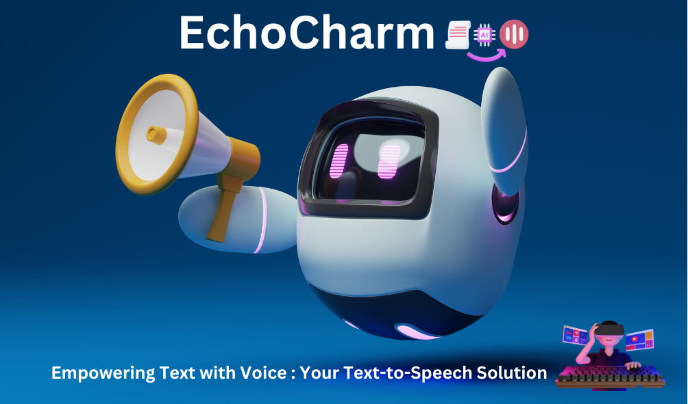

# EchoCharm 🗣️
Welcome to EchoCharm, a versatile text-to-speech application developed in Python using the `pyttsx3` library. EchoCharm lets you transform your textual input into spoken words using a variety of voices. Whether you're looking to hear your written content come alive, explore different voices, or experiment with speech synthesis, EchoCharm offers an engaging way to do so.

 
 
## Features and Highlights ✨

- 🎙️ **Voice Selection:** Choose from a diverse collection of available voices, each with its own distinct qualities and accents.
- 📣 **Auditory Experience:** Listen to your input text being dynamically spoken aloud in real-time.
- 🎭 **Voice Exploration:** Discover the personalities of different voices and explore how your text sounds with unique inflections.
- 🔄 **Interactive UI:** Enjoy a user-friendly command-line interface that guides you through the process.
- ❌ **Easy Exit:** Exit the application conveniently by entering "x."

## Getting Started 🚀

1. **Clone the Repository:** Begin by cloning this repository to your local machine:
```
git clone https://github.com/Shubh2-0/echocharm.git
```
2. **Install Dependencies:** Ensure you have the necessary library installed:
```
pip install pyttsx3
```

3. **Run the Application:** Launch the application by executing the echotext.py script:

```
python main.py
```

4. **Select a Voice and Speak:** Embark on your text-to-speech journey within the application:

    🤖 Browse the list of available voices and select one by entering the corresponding number.

    🤖 Enter the text you wish to hear spoken aloud.

    🤖 To exit the application, simply type **x** .


## Demo Video 🎥

Discover EchoCharm in action through our engaging demo video! Experience how EchoCharm's intuitive interface empowers users to convert text into spoken words using various available voices. Witness the seamless process of selecting voices, inputting text, and hearing it come to life. Join us on a journey of auditory exploration with EchoCharm.

[Watch EchoCharm Demo Video](https://drive.google.com/file/d/1iTy1Wtnaku85R8Bp19ygnWlK6Z6NWLf6/view?usp=sharing)

## Tools Used 🛠️

<table align="center">
  <tr>
    <td align="center" width="170">
      
      <br>Python 
    </td>
    <td align="center" width="170">
      
      <br>PyCharm
    </td>
    <td align="center" width="170">
      
      <br>Github
    </td>
  </tr>
 
</table>


## Contributions and Feedback 🤝
Contributions are encouraged! If you encounter issues, have innovative ideas, or wish to introduce new features, here's how you can contribute:

🐍  **Fork the Repository:** Begin by forking the repository to your GitHub account.

🐍  **Create a Feature Branch:** Create a branch to work on your feature: ```git checkout -b feature/YourFeatureName.```

🐍  **Commit Your Changes:** Commit your changes with a descriptive commit message: ```git commit -m 'Adding a remarkable feature'.```

🐍  **Push Your Branch:** Push your feature branch to your repository: ```git push origin feature/YourFeatureName.```

🐍  **Open a Pull Request:** Submit a pull request to merge your changes into the main repository.

## Acknowledgments and Credits 🙏

EchoCharm leverages the powerful **pyttsx3** library for its text-to-speech capabilities.
We extend our gratitude to the open-source community for its contributions and support.


## 📬 Contact

If you want to contact me, you can reach me through below handles.

 <p align="left">
  <a href="https://www.linkedin.com/in/shubham-bhati-787319213/" target="_blank"></a>&emsp;
  <a title="shubhambhati226@gmail.com" href="mailto:shubhambhati226@gmail.com" target="_blank"></a>&emsp;
  <a href="https://wa.me/+916232133187" target="blank"></a>&emsp;	
 </p>


🔊 Elevate your text with EchoCharm's auditory magic! We hope you enjoy the journey of turning words into sound.


